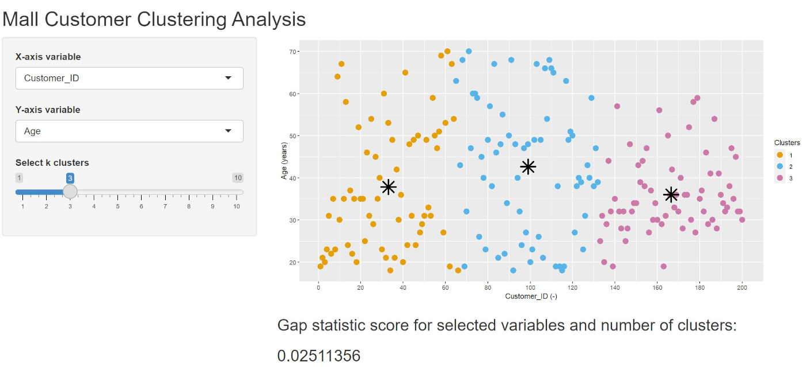

Mall customer clustering analysis
========================================================
author: David Taylor
date: 10/8/2021
autosize: true

Objective for this Assignment
========================================================
- To create a Shiny application including user input and display a reactive output deployed on RStudio's servers.&nbsp;
A reproducible presentation should also be provided to pitch the shiny application and prepared in RStudio Presenter

- The Shiny application and presentation code as well as data and images are available on the github repository: https://github.com/dvtaylora/Dev_Data_Product_W4/
- The Shiny application can be accessed at https://dvtaylor.shinyapps.io/Dev_Data_Product_A1W4/
- Finally the RStudio Presenter presentation is available  http://rpubs.com/dvtaylora/Dev_Data_Products_W4

Data set explored in this project
========================================================
- The Mall Customer Segmentation Data is used and can be found [here](https://www.kaggle.com/vjchoudhary7/customer-segmentation-tutorial-in-python) 

- The data consists in basic customer information such as ID, age, gender, income (K$), spending score (1-100) based on spending behavior. The table below shows the first 6 rows of the data set which contains data for 200 customers

<table class="table table-condensed">
 <thead>
  <tr>
   <th style="text-align:right;"> Customer_ID </th>
   <th style="text-align:right;"> Gender </th>
   <th style="text-align:right;"> Age </th>
   <th style="text-align:right;"> Annual_income </th>
   <th style="text-align:right;"> Spending_score </th>
  </tr>
 </thead>
<tbody>
  <tr>
   <td style="text-align:right;"> 1 </td>
   <td style="text-align:right;"> Male </td>
   <td style="text-align:right;"> 19 </td>
   <td style="text-align:right;"> 15 </td>
   <td style="text-align:right;"> 39 </td>
  </tr>
  <tr>
   <td style="text-align:right;"> 2 </td>
   <td style="text-align:right;"> Male </td>
   <td style="text-align:right;"> 21 </td>
   <td style="text-align:right;"> 15 </td>
   <td style="text-align:right;"> 81 </td>
  </tr>
  <tr>
   <td style="text-align:right;"> 3 </td>
   <td style="text-align:right;"> Female </td>
   <td style="text-align:right;"> 20 </td>
   <td style="text-align:right;"> 16 </td>
   <td style="text-align:right;"> 6 </td>
  </tr>
  <tr>
   <td style="text-align:right;"> 4 </td>
   <td style="text-align:right;"> Female </td>
   <td style="text-align:right;"> 23 </td>
   <td style="text-align:right;"> 16 </td>
   <td style="text-align:right;"> 77 </td>
  </tr>
  <tr>
   <td style="text-align:right;"> 5 </td>
   <td style="text-align:right;"> Female </td>
   <td style="text-align:right;"> 31 </td>
   <td style="text-align:right;"> 17 </td>
   <td style="text-align:right;"> 40 </td>
  </tr>
  <tr>
   <td style="text-align:right;"> 6 </td>
   <td style="text-align:right;"> Female </td>
   <td style="text-align:right;"> 22 </td>
   <td style="text-align:right;"> 17 </td>
   <td style="text-align:right;"> 76 </td>
  </tr>
</tbody>
</table>
Mall Customer Segmentation Data clustering exploration
========================================================
- The goal of this project is to allow the users to explore clustering of the Mall Customer Segmentation Data through a Shiny application 
- The users can select the x-axis and y-axis variable for clustering from drop down menus and the number of clusters with a slider.
- The application will compute the clustering based on the 3 user inputs, will color the data points belonging to each cluster and will place an asteriks ate the center of each cluster.
- The application will also return a score  (higher is better) for selected variables and number of clusters based on the gap statistic method (see method details [here](http://www.web.stanford.edu/~hastie/Papers/gap.pdf) )

Shiny application screenshot
========================================================

Screenshot of Shiny app Mall Customer Clustering Analysis. 

